# Reinforcement Learning and OpenAI Gym's Taxi-v3 Task
## Contents Overview
* [Part 1. Reinforcement Learning](##part-1-reinforcement-learning)
* [Part 2. OpenAI Gym’s Taxi-v3 Task](##part-2-openAI-gyms-taxi-v3-task)

## Part 1 Reinforcement Learning

### 1.1 What is Reinforcement Learning?
Reinforcement Learning (RL), like supervised learning and unsupervised learning, is a branch of machine learning. However, unlike the latter two, RL is not to make predictions or clustering, but to autonomously learn through the rewards and punishments based on the RL agent's interaction with the environment. This process is well illustrated in the figure below.

The agent-environment interaction in reinforcement learning. (Source: Sutton and Barto, 2017)

### 1.2 The Setting
* The reinforcement learning (RL) framework is characterized by an **agent** learning to interact with its **environment**.
* At each time step, the agent receives the environment’s **state** (_the environment presents a situation to the agent)_, and the agent must choose an appropriate **action** in response. One time step later, the agent receives a **reward** (_the environment indicates whether the agent has responded appropriately to the state_) and a new **state**.
* All agents have the goal to maximize expected **cumulative reward**, or the expected sum of rewards attained over all time steps.

### 1.3 Episodic vs. Continuing Tasks
* A **task** is an instance of the reinforcement learning (RL) problem.
* **Continuing tasks** are tasks that continue forever, without end.
* **Episodic tasks** are tasks with a well-defined starting and ending point.
	* In this case, we refer to a complete sequence of interaction, from start to finish, as an **episode**.
	* Episodic tasks come to an end whenever the agent reaches a **terminal state**.

### 1.4 Markov Decision Process (MDPs) and One-Step Dynamics
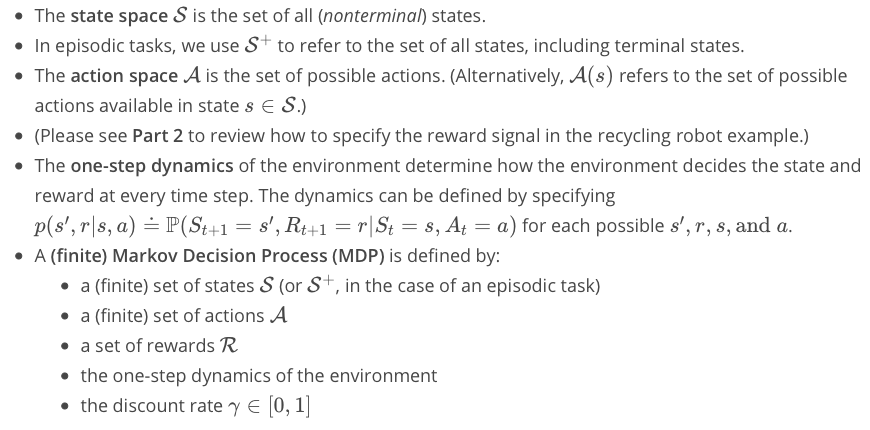

### 1.5 Q-table
When working with finite MDPs, we can estimate the action-value function qπ corresponding to a policy π in a table known as a **Q-table**.

### 1.6 Epsilon-Greedy Policies
* Epsilon-Greedy Policies A policy is ϵ-greedy with respect to an action-value function estimate Q if for every state  s ∈ S,
	* with probability 1 − ϵ, the agent selects the greedy action, and
	* with probability ϵ, the agent selects an action uniformly at random from the set of available (non-greedy AND greedy) actions.

### 1.7 Monte Carlo Methods (MC)

* Monte Carlo methods even though the underlying problem involves a great degree of randomness, we can infer useful information that we can trust just by collecting a lot of samples.
* The **equiprobable random policy** is the stochastic policy where from each state the agent randomly selects from the set of available actions, and each action is selected with equal probability.
* The biggest drawback of MC methods is that it does **not** applicable to **continuing tasks** since the agent needs to wait for the feedback until an episode ends which is the situation of **episodic tasks** where there is a clear terminal state
* MC methods update equation:

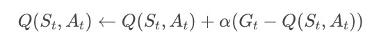

### 1.8 Temporal-Difference Methods (TD)
Whereas Monte Carlo (MC) prediction methods must wait until the end of an episode to update the value function estimate, temporal-difference (TD) methods update the value function after every time step.

### 1.9 Sarsa
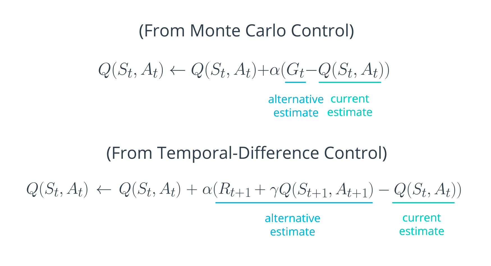
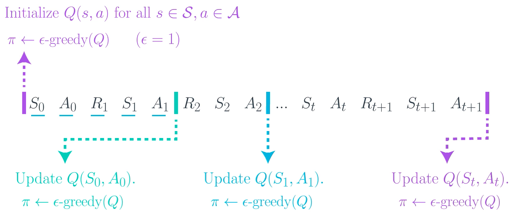

TD Control only uses a small time window of information. Instead of using the return Gt as the alternative estimate for updating q-table (needs to wait until an episode completed), Sum of the immediate reward Rt+1 and Q(St+1, At+1) of the current Q(St, At).
We don't want to update q-table after an episode, but update Q(St, At) every time step t. Therefore, we use sum of the immediate reward Rt+1 and the existing Q(St+1, At+1) in the table to replace return Gt in MC function as alternative estimate. This allows us to update Q(St, At) at each time step t.

### 1.10 Sarsamax (Q-Learning)

### 1.11 Difference between Sarsa and Sarsamax
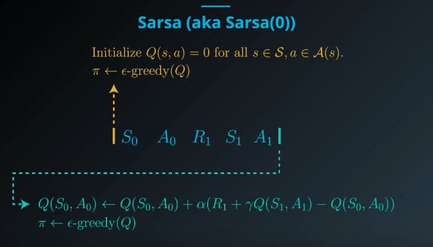

Sarsa is to update Q-table after A0, R1, S1 and A1 are chosen through epsilon-greedy(Q)

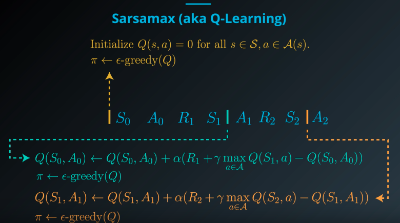

Sarsamax first chooses A0, R1 and S1 through epsilon-greedy (Q), and then chooses the a (pure greedy) which can maximize Q(St+1,a)  in Q-table before updating Q-table. And then repeat the process for T+1.

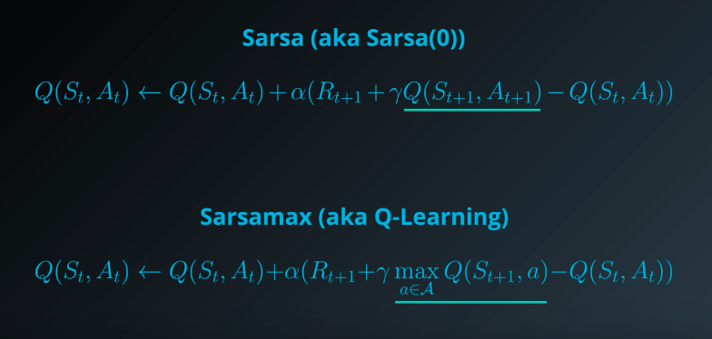

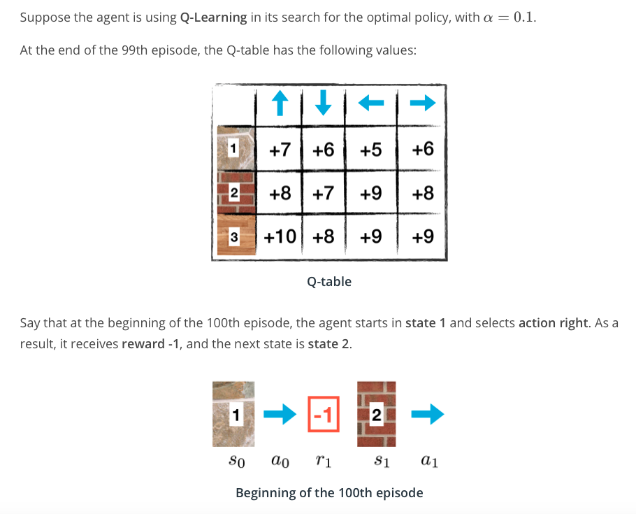

Q: What is the new value in the Q-table corresponding to the Q(s0, a0)?

A: Q(s0, a0) <— 6 + 0.1(-1 + 9 - 6) = 6.2.

### 1.12 Expected Sarsa

Q: What is the new value in the Q-table corresponding to the Q(s0, a0)?

A: Q(s0, a0) <— 6 + 0.1( -1 + [0.1 x 8] + [0.1 x 7] + [0.7 x 9] + [0.1 x 8] - 6) = 6.16.

### 1.14 Analyzing Performance
#### 1.14.1 Similarities
All of the TD control methods we have examined (Sarsa, Sarsamax, Expected Sarsa) converge to the optimal action-value function q∗(and so yield the optimal policy π∗) if:
	1. the value of ϵ decays in accordance with the GLIE conditions, and
	2. the step-size parameter α is sufficiently small.

#### 1.14.2 Differences
The differences between these algorithms are summarized below:
	* Sarsa and Expected Sarsa are both **on-policy** TD control algorithms. In this case, the same (ϵ-greedy) policy that is evaluated and improved is also used to select actions.
	* Sarsamax is an **off-policy** method, where the (greedy) policy that is evaluated and improved is different from the (ϵ-greedy) policy that is used to select actions.
	* On-policy TD control methods (like Expected Sarsa and Sarsa) have better online performance than off-policy TD control methods (like Sarsamax).
	* Expected Sarsa generally achieves better performance than Sarsa.

### 1.15 Greedy in the Limit with Infinite Exploration (GLIE)
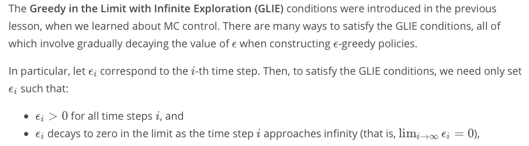

## Part 2. OpenAI Gym’s Taxi-v3 Task

“**The Taxi Problem**” was originated from the subsection 3.1 of the paper “[Hierarchical Reinforcement Learning with the MAXQ Value Function Decomposition](https://github.com/openai/gym/blob/master/gym/envs/toy_text/taxi.py)” by Tom Dietterich

* The description of the problem from OpenAI Gym is referenced here: [taxi.py](https://github.com/openai/gym/blob/master/gym/envs/toy_text/taxi.py)

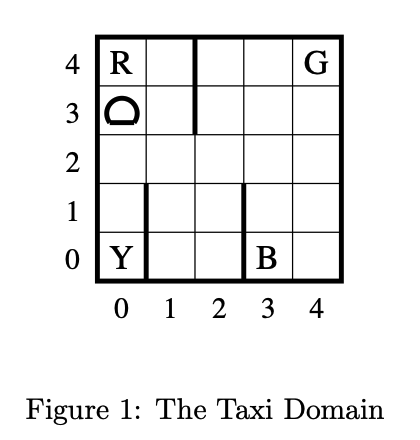

“Hierarchical Reinforcement Learning with…” by Tom Dietterich

> Brief Description:  
> 	There are four designated locations in the grid world indicated by R(ed), G(reen), Y(ellow), and B(lue). When the episode starts, the taxi starts off at a random square and the passenger is at a random location. The taxi drives to the passenger’s location, picks up the passenger, drives to the passenger’s destination (another one of the four specified locations), and then drops off the passenger. Once the passenger is dropped off, the episode ends.  
>   
> Observations:   
> 	There are 500 discrete states since there are 25 taxi positions, 5 possible locations of the passenger (including the case when the passenger is in the taxi), and 4 destination locations.   

Also, There are 6 possible actions, corresponding to moving North, East, South, or West, picking up the passenger, and dropping off the passenger.

### 2.1 Files:
* `agent_Sarsa.py`: The class of RL agent developed with Sarsa method
* `agent_Sarsamax.py`: The class of RL agent developed with Sarsamax (Q-Learning) method
* `agent_ExpectedSarsa.py`: The class of RL agent developed with Expected Sarsa method
* `monitor_Sarsa.py`: The interact function tests how well our Sarsa agent learns from interaction with the environment.
* `monitor_Sarsamax.py`: The interact function tests how well our Sarsamax (Q-Learning) agent learns from interaction with the environment.
* `monitor_ExpectedSarsa.py`: The interact function tests how well our Expected Sarsa agent learns from interaction with the environment.
* `main.py`: Run this file in the terminal to check the performance of our agents.

**I set all seeds to be 505 for the reproducible results.**

### 2.2 Sarsa Result
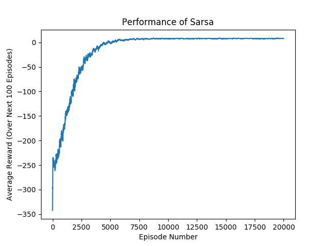

### 2.3 Sarsamax (Q-Learning) Result
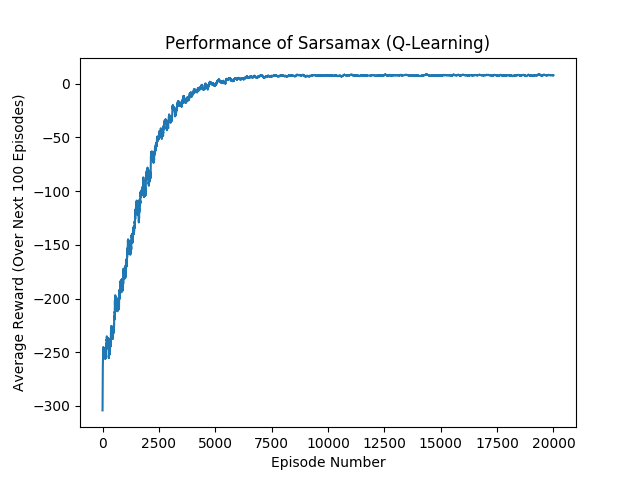

### 2.4 Expected Sarsa Result
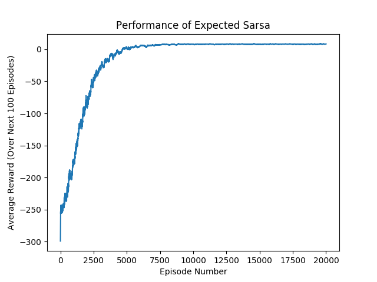

### 2.5 Comparison of Results
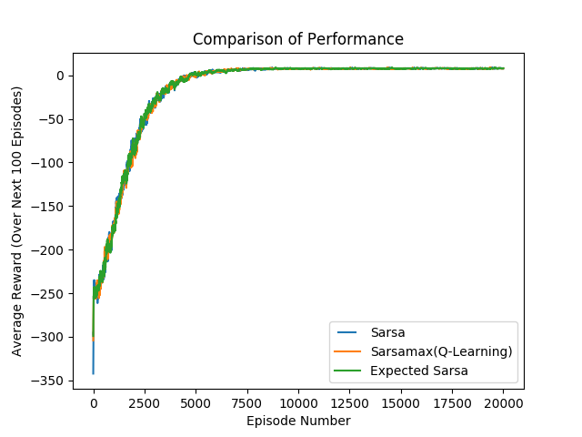
