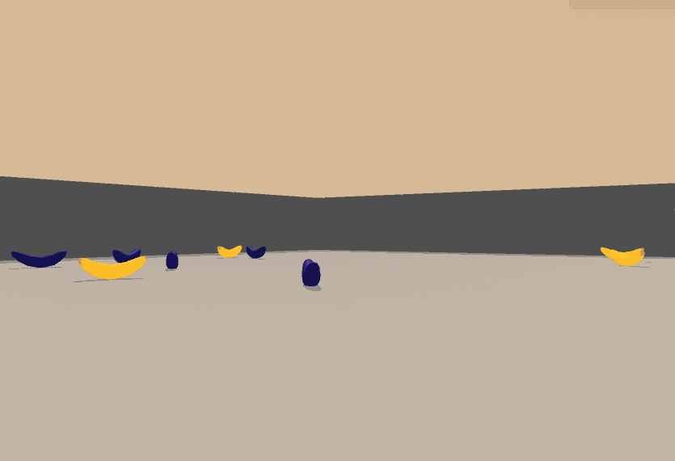

# Value-Based Methods: DQN and Its Improvements
| Before Training | Trained |
| --- | ----------- |
|  |  |

## Contents Overview
* Part 0. Project Description and Environment
* Part 1. Deep Q-Learning
* Part 2. Deep Q-Learning Improvements

## Part 0. Project Description and Environment
### Introduction to the project
For this project, I will train an agent to navigate (and collect bananas!) in a large, square world.

A reward of +1 is provided for collecting a yellow banana, and a reward of -1 is provided for collecting a blue banana. Thus, the goal of your agent is to collect as many yellow bananas as possible while avoiding blue bananas.
The state space has 37 dimensions and contains the agent’s velocity, along with ray-based perception of objects around the agent’s forward direction. Given this information, the agent has to learn how to best select actions. Four discrete actions are available, corresponding to:
* `0` - move forward.
* `1 ` - move backward.
* `2 ` - turn left.
* `3 ` - turn right.

The task is episodic, and in order to solve the environment, the agent must get an average score of +13 over 100 consecutive episodes.

### Set up the environment (If anyone also wants to try)
#### Step 1: Clone the this Repository
Follow the  [instructions in the DRLND GitHub repository](https://github.com/udacity/deep-reinforcement-learning#dependencies)  to set up your Python environment. These instructions can be found in README.md at the root of the repository. By following these instructions, you will install PyTorch, the ML-Agents toolkit, and a few more Python packages required to complete the project.
(/For Windows users/) The ML-Agents toolkit supports Windows 10. While it might be possible to run the ML-Agents toolkit using other versions of Windows, it has not been tested on other versions. Furthermore, the ML-Agents toolkit has not been tested on a Windows VM such as Bootcamp or Parallels.

#### Step 2: Download the Unity Environment
For this project, you will **not** need to install Unity - this is because we have already built the environment for you, and you can download it from one of the links below. You need only select the environment that matches your operating system:
* Linux:  [click here](https://s3-us-west-1.amazonaws.com/udacity-drlnd/P1/Banana/Banana_Linux.zip)
* Mac OSX:  [click here](https://s3-us-west-1.amazonaws.com/udacity-drlnd/P1/Banana/Banana.app.zip)
* Windows (32-bit):  [click here](https://s3-us-west-1.amazonaws.com/udacity-drlnd/P1/Banana/Banana_Windows_x86.zip)
* Windows (64-bit):  [click here](https://s3-us-west-1.amazonaws.com/udacity-drlnd/P1/Banana/Banana_Windows_x86_64.zip)

Then, place the file in the p1_navigation* folder in the DRLND GitHub repository, and unzip (or decompress) the file.
(*For Windows users*) Check out  [this link](https://support.microsoft.com/en-us/help/827218/how-to-determine-whether-a-computer-is-running-a-32-bit-version-or-64)  if you need help with determining if your computer is running a 32-bit version or 64-bit version of the Windows operating system.

(*For AWS*) If you’d like to train the agent on AWS (and have not  [enabled a virtual screen](https://github.com/Unity-Technologies/ml-agents/blob/master/docs/Training-on-Amazon-Web-Service.md) ), then please use  [this link](https://s3-us-west-1.amazonaws.com/udacity-drlnd/P1/Banana/Banana_Linux_NoVis.zip)  to obtain the “headless” version of the environment. You will **not** be able to watch the agent without enabling a virtual screen, but you will be able to train the agent. (/To watch the agent, you should follow the instructions to* [enable a virtual screen](https://github.com/Unity-Technologies/ml-agents/blob/master/docs/Training-on-Amazon-Web-Service.md) *, and then download the environment for the***Linux***operating system above.*)

#### Step 3: Explore the Environment
After you have followed the instructions above, open Navigation.ipynb (located in the p1_navigation* folder in the DRLND GitHub repository) and follow the instructions to learn how to use the Python API to control the agent.

### Files:
* `Navigation.ipynb`: The Jupyter Notebook of my solution
* `dqn_agent.py`: The code sets up the agent using Deep Q-Learning algorithm
* `model.py`: The code sets up the neutral network
* `checkpoint.pth`: The weights of the trained model
* `Report.pdf`: The project report

## Part 1. Deep Q-Learning
### 1.1 Review of the Q-Learning (Sarsamax)
When working with finite MDPs, we can estimate the action-value function qπ corresponding to a policy π in a table known as a **Q-table**.

One Q value corresponds to a (s, a) pair. You can think of a large table of all such (s, a) paired Q values, with the horizontal column representing states S, the vertical column representing actions A, and a Q value in each of the cells:

Then, we follow the Q-Learning algorithm to update the Q-table to have the optimal function Q(s, a) eventually:

### 1.2 Curse of Dimension and the Value Function Approximation

#### Curse of Dimension
We mentioned that in Q-Learning we can have a Q-table to store the values correspond to (s, a) pairs, as a representation of the optimal function Q(s, a). However, there is a problem with this Q-table representation. What if there are thousands or even millions of states? Can we just store them in a Q-table and let out computers to figure out? Probably not a good idea :)

For example, if we use the Q-Learning to play the Atari Breakout game and our computer directly percept the environment with the raw image data every frame of the game, which mean each image is 210x160 pixels, and then the output are actions. So in this case, how many states are there? It could be different every second. Theoretically, if each pixel has 256 actions, then there are: 256^(210x160) states, which is impossible for us to store into a Q-table.

#### Value Function Approximation

In stead of using a Q-table as the representation of Q(s, a), we can use a function *f* to represent Q(s, a), i.e. f(w, s, a) = Q(s, a), where *f* can be any linear or non-linear function and *w* is its parameter.

However, since *f* is an approximation, as we do not know exactly how the Q values distribute, we would say f(w, s, a) ≈ Q(s, a)

So, no matter how many dimensions the states *s* has, the function approximation *f* will map the states and actions spaces into a single Q-value or a vector of Q-values. Why the output may be a vector of Q-value? Because, if the states are in high-dimension space (e.g. pixels of images), but the actions are in low-dimension space (e.g. up, down, left, right, etc), we shall just reduce the dimensions of the states space. In other words, f(w, s) ≈ Q(s, a). We only take a state s as the input of *f* and it will output a vector of Q-values of all actions (a1,…, an) in terms of the input state s (which could be an image): [Q(s, a1),Q(s, a2),Q(s, a3),…,Q(s, an)].

#### Deep Neural Networks as a Function Approximator

[Source](https://storage.googleapis.com/deepmind-media/dqn/DQNNaturePaper.pdf)

We want to implement a deep neural network as a value function approximator *f*. For the example of Atari Breakout game above, the input are four sequential 84x84 grey scale images after processed. The neutral net involves two convolution layers, two full connection layers, and finally the output is a vector of Q values for each action. This is the basic structure of Deep Neural Networks, or DQN.

#### Fixed Q-Targets
So how we train this neutral net? What are the training samples? What is the loss function to optimize?

For the training samples, recall how we update the Q-table in Q-Learning.

The term  here is the target Q-value and we will use this term as the label for training. The the training samples can be generated by ɛ-greedy methods.

Since the training samples and their labels are defined, here comes the loss function:

> Specifically, in Q-Learning, we **update a guess with a guess**, and this can potentially lead to harmful correlations. To avoid this, we can update the parameters *w* in the network Q to better approximate the action value corresponding to state **S** and action **A** with the following update rule:
> 
> where w^- (aka w_t-1) are the weights of a separate target network that are not changed during the learning step, and **(S,A,R,S’)** is an experience tuple.

#### Experience Replay
According to the sample size of each update, there are two update methods: Incremental Methods and Batch Methods (Experience Replay).
The DQN proposed in the paper by DeepMind adopts **Experience Replay** method. When training the neural network, we assume that the samples are independently and identically distributed. However, there is a correlation between the samples collected through reinforcement learning. Using these data for sequential training will lead to the instability of the neural network. Experience Replay can break the correlation between sample data. In other words,

> when the agent interacts with the environment, the sequence of experience tuples can be highly correlated. The naive Q-learning algorithm that learns from each of these experience tuples in sequential order runs the risk of getting swayed by the effects of this correlation. By instead keeping track of a **replay buffer** and using **experience replay** to sample from the buffer at random, we can prevent action values from oscillating or diverging catastrophically.
> The **replay buffer** contains a collection of experience tuples **(S,A,R,S’)**. The tuples are gradually added to the buffer as we are interacting with the environment.
> The act of sampling a small batch of tuples from the replay buffer in order to learn is known as **experience replay**. In addition to breaking harmful correlations, experience replay allows us to learn more from individual tuples multiple times, recall rare occurrences, and in general make better use of our experience.

#### Deep Q-Learning Algorithm

## Deep Q-Learning Improvements
Several improvements to the original Deep Q-Learning algorithm have been suggested. Over the next several videos, we’ll look at three of the more prominent ones.

### Double DQN
Deep Q-Learning  [tends to overestimate](https://www.ri.cmu.edu/pub_files/pub1/thrun_sebastian_1993_1/thrun_sebastian_1993_1.pdf)  action values.  [Double Q-Learning](https://arxiv.org/abs/1509.06461)  has been shown to work well in practice to help with this.
It uses the current Q network to select the action and the older (target) Q network to calculate the target Q value.

### Prioritized Experience Replay
Deep Q-Learning samples experience transitions *uniformly* from a replay memory.  [Prioritized experienced replay](https://arxiv.org/abs/1511.05952)  is based on the idea that the agent can learn more effectively from some transitions than from others, and the more important transitions should be sampled with higher probability.

### Dueling DQN
Currently, in order to determine which states are (or are not) valuable, we have to estimate the corresponding action values *for each action*. However, by replacing the traditional Deep Q-Network (DQN) architecture with a  [dueling architecture](https://arxiv.org/abs/1511.06581) , we can assess the value of each state, without having to learn the effect of each action.

[Tutorial: Deep Reinforcement Learning, David Silver, Google DeepMind](https://icml.cc/2016/tutorials/deep_rl_tutorial.pdf)
